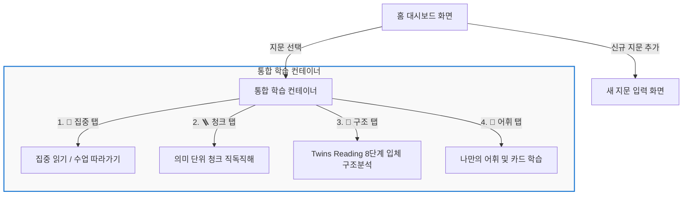

# 08. 사용자 인터페이스 및 경험 흐름 명세 (UI_UX_FLOW.md) (LingoStar Vision Reader)

작성일: 2026년 05월 28일

본 문서는 **LingoStar Vision Reader**의 화면 설계, 사용자 동선, 반응형 인터페이스 및 저시력 접근성 요소를 고려한 세부 UI/UX 작동 흐름을 정의합니다.

---

## 1. 핵심 화면 구성 및 내비게이션 구조

본 웹앱은 사용성 극대화와 인지 부하 감소를 위해 불필요한 레이어를 제거하고 단일 페이지 어플리케이션(SPA) 기반의 직관적인 **4단 탭 바 인터랙션 모델**을 채택하고 있습니다.

---

## 2. 세부 화면별 UI/UX 흐름 (Flow Details)

### 2-1. 홈 대시보드 화면 (`App.jsx` 내 Home View)
- **주요 기능**: 학습할 영어 지문 리스트 조회, 삭제, 진입.
- **UI 구성**:
  - 로고 및 글로벌 테마 셀렉터 (상단 고정).
  - "새 지문 입력하기" 버튼 (우측 상단, 최소 60px 높이).
  - 지문 카드 리스트 (그리드 배치, 카드 전체가 클릭 가능하여 오터치 해소).
  - 지문 카드 내 제목, 문장 수, 생성 날짜, 본문 앞부분 미리보기(2줄 제한) 및 삭제 버튼 탑재.
- **UX 인터랙션**:
  - 지문 카드를 클릭하면 즉시 통합 학습 컨테이너의 **1. 집중 탭**으로 이동하며 학습을 시작합니다.
  - 저장된 지문이 아예 없는 경우 돋보이는 일러스트(📖)와 함께 "첫 지문 추가하기" 가이드가 노출되는 **빈 대시보드 상태(Empty State)**를 아름답게 제공합니다.

### 2-2. 새 지문 입력 화면 (`PassageInputPage.jsx`)
- **주요 기능**: 교사나 학생이 새로운 영어 지문을 등록 및 자동 파싱 처리.
- **UI 구성**:
  - "이전(홈으로)" 및 "저장하기" 거대 버튼.
  - 지문 제목 입력 폼 (텍스트 박스, 크기 24px).
  - 학년/난이도 선택 단추 (초등, 중학, 고등, 일반 등 테마 버튼).
  - 지문 본문 입력 영역 (Textarea, 폰트 22px로 큼직하게 입력 가능).
  - **샘플 지문 원클릭 불러오기** 보조 버튼 (기획 요건 준수: 비문학 샘플 2종 즉시 채움).
- **UX 인터랙션**:
  - "저장하기" 클릭 시 정밀 파서(`textParser.js`)가 구동되어 약어 엣지 케이스 및 슬래시(/) 중복 오염 데이터를 정제 및 중복 제거합니다.
  - 저장 완료 시 데이터베이스에 업로드되고 홈으로 자동 이동하여 최신 지문을 상단에 배치합니다.

### 2-3. 통합 학습 컨테이너 (`StudyContainerPage.jsx`)
학습이 시작되면 상단 미니맵 헤더와 하단 탭 내비게이션이 고정되어 학생의 위치 인지를 돕습니다.

#### 1) 📖 집중 읽기 탭 (`ClassFollowModePage.jsx`)
- **사용자 흐름**: 선생님 수업 진도에 완벽 싱크를 맞추는 집중 뷰어.
- **작동 흐름**:
  - 화면 중앙에 **단 하나의 영어 문장만 초대형(최대 120px)으로 거대하게 렌더링**됩니다.
  - 하단의 72px 이상 Mega UI 버튼 [이전 문장], [다음 문장]을 탭해 문장을 이동합니다.
  - **원어민 낭독(TTS)** 단추 클릭 시 재생 배속에 맞춰 실시간 낭독이 출력됩니다.
  - **숙어 다중선택 모드** 활성화 시, 본문 단어들을 순서대로 터치하면 실시간으로 하단에 이디엄이 조합되며 뜻을 탐색하고 저장할 수 있습니다.
  - 모르는 단어를 터치하면 **어휘 구조 분석 모달**이 열려 한글 뜻과 동의어, 반의어, 유사숙어 정보가 입체적으로 제공되며 단어장으로 즉시 저장할 수 있습니다.

#### 2) 🪜 청크 직독직해 탭 (`ChunkReadingPage.jsx`)
- **사용자 흐름**: 긴 문장을 호흡 단위(의미 덩어리)로 쪼개어 시선 분산을 막고 어순을 자연스럽게 인지하는 단계.
- **작동 흐름**:
  - 현재 문장이 의미 덩어리(Chunk) 카드 배열로 아래로 수직 나열됩니다.
  - 사용자는 카드를 탭하여 **AI 구문 성분 배지(주어 S, 동사 V, 목적어/보어 O, 수식어 M)** 및 일대일 한글 직독직해 번역과 문법 팁 카드를 즉시 토글하여 정답을 확인(Interactive Quiz)할 수 있습니다.
  - 카드 우측의 개별 재생 버튼(🔊)으로 특정 의미 구절만 반복 청취하여 리스닝 훈련을 진행합니다.

#### 3) 🧱 8단계 입체 구조분석 탭 (`ParagraphStructurePage.jsx`)
- **사용자 흐름**: 지문 전체의 3중 핵심 구조(도입-본문-맺음)와 문맥적 흐름을 관통하는 고난도 독해 마스터 코스.
- **8단계 스텝퍼 인터랙션**:
  - **1단계 & 3단계 (단어 플립 카드)**: 지문 속 단어 카드를 터치하여 180도 부드럽게 회전(flip)시키며 뜻과 유의어/반의어를 암기합니다.
  - **2단계 & 4단계 (5단계 입체 계단 & SVG 브릿지 맵)**: 유기적 곡선 경로의 3중 구조 브릿지 SVG 맵이 렌더링됩니다. **[도입 (Intro)]** 노드를 클릭하면 도입부 2문장이 각각 미려한 HSL 컬러 블록 다이어그램 맵으로 표현되며, 복잡한 s/v 밑줄을 완전히 배제하고 직관적인 블록 구조로 가인식됩니다.
  - **5단계 (영문 슬래시 끊어읽기)**: 수직 슬래시(/) 구획 표시를 통해 시인성이 확보된 지문 전체를 읽어 내려갑니다.
  - **6단계 (문장 8회독 챌린지)**: 문장 우측의 [회독수] 단추를 누르면 숫자가 1씩 증가하며 8회독 완수 시 축하 TTS 메시지가 출력됩니다.
  - **7단계 (정밀 3단 분석표)**: 기획서 규격 그대로 영어 원문(E), 주어(파란 테두리)/동사(빨간 테두리)/수식어(괄호)가 적용된 번역(EK), 그리고 1~5형식 구문 분류 단추 세트가 3단 테이블 형태로 노출됩니다.
  - **8단계 (영어 어순 영작 퀴즈)**: 흩어진 단어 타일을 탭하여 한글 어순 번역에 부합하도록 영어 문장 구조를 완벽 조립하는 타일 퍼즐입니다. 성공 시 칭찬 음성 피드백이 제공됩니다.

#### 4) 📒 나만의 단어장 탭 (`VocabularyPage.jsx`)
- **사용자 흐름**: 학습 중 누적 저장한 단어들을 모아 복습하고 자가 테스트하는 전용 학습장.
- **작동 흐름**:
  - **세션 1 (나만의 집중 학습 단어장)**: 본문에서 터치로 추가된 단어가 실시간으로 나열되며, 잘못 연동된 영어 뜻이 들어온 경우 `dictMock` 기반으로 한글 뜻을 실시간 자동 교정하여 렌더링합니다.
  - **세션 2 (동의어 · 반의어 어휘 카드)**: 모범 단어 5종 카드가 큼직하게 배치되어 있으며, 클릭 시 🔼/🔽 상태 토글과 함께 뜻이 비슷한 단어(Synonyms)와 반대 단어(Antonyms)가 HSL 칩 형태로 입체적으로 펼쳐집니다.

---

## 3. 시각 접근성 핵심 편의 플로우 (A11y Overlay Controls)

어떤 화면에서든 상단의 **👁️ 눈보호 설정** 단추를 탭하면 다음 4가지 강력한 접근성 조작 장치가 실시간 반영됩니다.

1. **글자 크기 스텝퍼 (FontSize Step)**: `＋` 및 `－` 터치 단추를 누르면 24px부터 최대 120px까지 화면의 모든 핵심 폰트 크기가 즉각 동적 리플로우(Reflow) 개행 처리됩니다.
2. **눈부심 차단 필터 (Brightness Overlay)**: 슬라이더를 드래그하면 화면 전체에 완전 불투명 블랙 레이어 암막 오버레이(`opacity: 0% ~ 70%`)가 투사되어 광민감성 학습자의 안구 피로를 상쇄합니다.
3. **색상 반전 & 흑백대비 (Special Contrast Filter)**:
   - **색상 반전**: CSS `filter: invert(1) hue-rotate(180deg)` 속성을 통해 눈부심 없는 부드러운 다크 모드로 텍스트 컬러가 완벽 역상 처리됩니다.
   - **흑백 모드**: CSS `filter: grayscale(1)`를 통해 불필요한 색 자극을 0%로 소거합니다.
4. **5종 배경대비 테마 선택**:
   - `Light` (밝게) ➔ `Dark` (차콜 네이비) ➔ `Yellow` (크림 옐로우) ➔ `Blue Soft` (소프트 스카이) ➔ `High Contrast` (최중증 저시력용 흑황대비 AAA) 테마를 원터치로 변경해 본인의 안구 상태에 맞춤 설정합니다.
